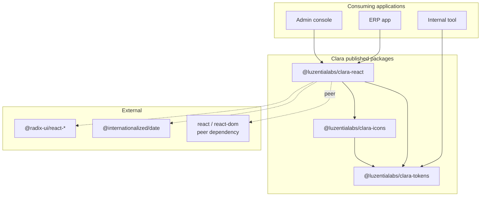

# Technical Requirements Document

**Project:** Clara Design System
**Version:** 0.1.0
**Status:** Draft
**Last Updated:** 2026-08-21
**PRD Reference:** [PRD v0.2.0](prd.md)
**Decisions:** [decisions.md](decisions.md) D0001-D0012

---

## 1. Executive Summary

### Purpose

This TRD specifies how Clara is built, packaged, and published. It exists mainly to hold the
decisions that become **permanent at first publish** - the public surface, the token architecture,
the CSS delivery model, and the cascade contract - so they are settled deliberately rather than by
whoever installs the package first.

### Scope

**Covered:** package topology and dependency rules, the public API surface and its enforcement,
token architecture, styling and cascade strategy, portal and scoping architecture, server/client
component boundaries, build and release pipeline, supply chain security, performance budgets.

**Not covered:** the visual language itself (F00 foundations pass produces it), test strategy (the
TSD), and per-component design (epics and stories).

**Not applicable to this project type:** HTTP API contracts, database schema, authentication,
authorization, deployment topology, scaling, and disaster recovery. Clara is a client-side library
with no backend, no persistence, and no network calls. Those template sections are marked N/A
below rather than filled with invented content.

### Key Decisions

- Three-tier token architecture; **tier 2 is the only public token API** (D0007)
- All CSS emitted inside `@layer clara.reset, clara.tokens, clara.components;` (D0005)
- One stylesheet per package, deliberately not tree-shaken; closed `exports` map (D0006)
- Radix UI behind a hard isolation boundary; no Radix API is Clara API (D0003)
- `as` is the single polymorphism idiom (D0008)
- Theme and density propagate through **React context**, not DOM inheritance, so portaled
  content inherits correctly (ADR-006 - this refines PRD F02)
- Vite library mode, plain pnpm workspaces, `@internationalized/date`, blocking API report gate
  (D0009-D0012)

---

## 2. Project Classification

**Project Type:** SDK / Library, with a **Monorepo** modifier.

**Classification Rationale:** Clara serves no web frontend of its own, exposes no APIs to other
systems, and has no runtime of its own. It is reusable code consumed at build time by other
applications. The monorepo modifier applies because it publishes three independently versioned
packages plus two internal applications (Storybook, docs).

**Architecture Implications:**

- **Default Pattern:** Modular (per `reference-architecture.md` for SDK/Library)
- **Pattern Used:** Modular, layered, token-first
- **Deviation Rationale:** None. The default fits.

**What this classification changes about the risk profile:** the usual web-application risks
(availability, data breach, scaling) do not apply. The risks that replace them are **blast radius**
(a defect reaches every consuming application at once) and **permanence** (a published version
cannot be recalled; a renamed export breaks consumers already shipped). Every architectural
decision below is weighted against those two, not against uptime.

---

## 3. Architecture Overview

### System Context

Clara has no runtime environment of its own. It is compiled into consuming applications at their
build time and executes inside their browser context.



### Architecture Pattern

**Modular, layered monorepo.** Strict one-directional dependency: `react` -> `icons` -> `tokens`
-> `tokens/*.json`. A cycle or an upward reference is a build failure, not a code review comment.

**Rationale:** the layering is what lets a consumer adopt `clara-tokens` alone and style their own
markup without pulling in React. That is a stated PRD requirement, and it only holds if the lower
layers never reach upward.

### Component Overview

| Component | Responsibility | Technology |
|-----------|---------------|------------|
| `tokens/*.json` | Source of truth for the visual language, three tiers | JSON |
| `@luzentialabs/clara-tokens` | Compiles tokens to CSS variables, TS constants, JSON, and the public/pairings manifests | Style Dictionary |
| `@luzentialabs/clara-icons` | SVG icon set as tree-shakeable React components | SVGR, Vite |
| `@luzentialabs/clara-react` | The component library and its single stylesheet | React, CSS Modules, Radix |
| `apps/storybook` | Component playground, a11y addon, visual baselines | Storybook |
| `apps/docs` | Design language reference, built with Clara itself | Astro |
| `apps/reference-app` | A real list screen and form screen, built on Clara | Vite + React |

> `apps/reference-app` is PRD **F31**, a gating must-have: no feature row may be marked Complete
> for v1.0 until the reference application renders on it.

### Repository Topology

```
packages/
  tokens/     src/{primitive,semantic,component}/*.json  ->  dist/
  icons/      src/*.svg  ->  generated components  ->  dist/
  react/      src/components/<Name>/{index.tsx,styles.module.css,stories.tsx}
apps/
  storybook/  docs/  reference-app/
```

---

## 4. Technology Stack

### Core Technologies

| Category | Technology | Version | Rationale |
|----------|-----------|---------|-----------|
| Language | TypeScript | 5.x, strict | The public surface is enforced by types; a wrong call should fail at compile time, not runtime. No `any` in public API |
| UI runtime | React | 18.2+ and 19.x, **peer** | Peer, never bundled, so a consumer never gets two Reacts |
| Styling | CSS Modules + CSS custom properties | - | Zero runtime cost, SSR-safe, themeable by re-declaring variables. See ADR-001 |
| Primitives | Radix UI | latest | Correct WAI-ARIA for dialog, popover, select, tooltip, menu, tabs. Behind an isolation boundary. See ADR-004 |
| Date | `@internationalized/date` | latest | Models calendar dates as distinct from instants, which F12 must document. Immutable, locale-aware. See ADR-008 |
| Class composition | `clsx` | latest | ~200 bytes; avoids a hand-rolled equivalent |
| Token pipeline | Style Dictionary | 4.x | Mature multi-format token compilation; emits CSS, TS, and JSON from one source |
| Build | **Vite library mode** | 5.x/6.x | Native CSS Modules handling, which is decisive given D0006. See ADR-007 |
| Types | `vite-plugin-dts` | latest | Declaration generation from the Vite build |
| Monorepo | **pnpm workspaces**, plain scripts | pnpm 9+ | Three packages do not need a task graph yet. See ADR-009 |
| Versioning | Changesets | latest | Enforces a written changeset per package-touching PR |

### Build & Development

| Tool | Purpose |
|------|---------|
| `vite` | Library builds for all three packages |
| `@microsoft/api-extractor` | Generates the committed API surface report; CI diffs it. See ADR-010 |
| `publint`, `attw` | Package correctness and TypeScript resolution across module modes |
| `size-limit` | Enforces the CSS and JS budgets in Section 10 |
| `stylelint` | Enforces the token-tier rule in component CSS (custom rule) |
| `eslint`, `prettier` | Lint and format |
| `vitest`, `@testing-library/react`, `axe-core` | Unit, interaction, and accessibility assertions |
| `playwright` | Keyboard interaction tests and visual baselines |
| `changesets` | Version and changelog management |

### Infrastructure Services

| Service | Provider | Purpose |
|---------|----------|---------|
| Package registry | npm (public) | Publishing under `@luzentialabs` |
| CI | GitHub Actions | Gates and automated publish |
| Static hosting | TBD (Vercel / Netlify / Pages) | Docs site and Storybook |

---

## 5. Public API Contracts

> Replaces the template's HTTP "API Contracts" section. Clara exposes no network API. **This is the
> surface that matters, and every item in it is permanent once published.**

### Published surface

| Package | Exports |
|---------|---------|
| `@luzentialabs/clara-tokens` | `tokens.css`, `themes/dark.css`, typed constants, `tokens.json`, `tokens.public.json` |
| `@luzentialabs/clara-icons` | One named component per icon, plus an `Icon` base |
| `@luzentialabs/clara-react` | Named component exports, their prop types, `useToast`, and `styles.css` |

### Exports map (closed - no `./*` wildcard)

| Package | Public subpaths |
|---------|-----------------|
| `clara-tokens` | `.`, `./tokens.css`, `./themes/dark.css`, `./tokens.json`, `./tokens.public.json`, `./package.json` |
| `clara-icons` | `.`, `./package.json` |
| `clara-react` | `.`, `./styles.css`, `./package.json` |

Every reachable subpath is a permanent promise. A wildcard would publish the entire `dist` tree as
API by accident. CI fails if a wildcard is introduced.

`tokens.pairings.json` is deliberately **not** in either table. It is build-time input to the contrast
gate, read from inside the repository, not a consumer-facing artefact. Publishing it would make the
pairing table a permanent promise that the contrast gate could then never restructure (D0029).

### Component contract

Every component in `clara-react`:

1. forwards `ref` to its principal DOM element
2. spreads unrecognized props onto that element
3. accepts `className`, merged after its own classes
4. accepts `style`, applied last
5. requires no context provider except where documented (`ClaraProvider`, `ToastProvider`)

### Controlled and uncontrolled convention

Two rules, applied by component shape. Inconsistency here is permanent, so it is written down
rather than left to instinct.

| Component shape | Convention | Examples |
|-----------------|-----------|----------|
| Wraps a single native form control | Native React idiom: `value` / `defaultValue` / `onChange` receiving the native event | `Input`, `Textarea`, `Checkbox`, `Radio`, `Switch` |
| Composite widget with a semantic value | `value` / `defaultValue` / `onValueChange` receiving the value itself, not an event | `Select`, `Combobox`, `MultiSelect`, `DatePicker`, `Tabs` |

Uncontrolled is the default in both cases. Supplying `value` without its change handler emits a
development warning, matching React's own convention.

### Polymorphism

`as` is the **only** polymorphism idiom, on layout primitives, `Button`, and overlay triggers.
`asChild` is Radix's idiom and is not re-exported (D0008, ADR-005). Prop types are inferred from
the `as` target so invalid attribute combinations fail at compile time.

### API surface enforcement

`api-extractor` generates a committed `<package>.api.md` per package. CI regenerates and diffs it;
an uncommitted change **fails the build**. This makes a public surface change visible in review
rather than discovered by a consumer on install. See ADR-010.

### Error / failure format

Clara returns no error payloads. Misconfiguration surfaces as a development-mode `console.warn`
naming the component, the problem, and the fix, stripped from production builds via
`process.env.NODE_ENV`.

---

## 6. Token Architecture

> Replaces the template's "Data Architecture". Clara persists nothing; the token graph is its data
> model.

### Tier model

| Tier | Location | May reference | Public API? |
|------|----------|--------------|-------------|
| 1. Primitive | `src/primitive/*.json` | nothing | **Private** - may change in a minor |
| 2. Semantic | `src/semantic/*.json` | tier 1 only | **Public** - covered by the breaking-change rule |
| 3. Component | `src/component/*.json` | tier 2 only | **Private** - may change in a minor |

Semantic families: `neutral`, `accent`, `selected`, and the four status intents (`info`, `success`,
`warning`, `danger`), across `fg`, `bg`, and `border`, plus `fg-readonly` and the two focus tokens
(ring, offset).

### Build outputs

| Artifact | Contents | Consumer |
|----------|----------|----------|
| `tokens.css` | All tiers as CSS custom properties, light theme | Applications |
| `themes/dark.css` | Tier 1 and 2 overrides only | Applications |
| `tokens.ts` | Typed constants | TS consumers, tests |
| `tokens.json` | Full graph | Figma sync (v1.1) |
| `tokens.public.json` | **Exactly the tier 2 set** | Docs site, the public-reference CI check |
| `tokens.pairings.json` | The enumerated legal pairings (PRD Section 7) | The contrast test |

### Build-time constraints

| Constraint | Enforcement | Severity |
|------------|-------------|----------|
| Tier 2 references only tier 1 | Style Dictionary validation | Error |
| Tier 3 references only tier 2 | Style Dictionary validation | Error |
| Component CSS references only tier 2 or 3 | Custom stylelint rule over `packages/react/**/*.module.css` | Error |
| Component CSS contains no color/space/radius literal | Custom stylelint rule | Error |
| Docs and examples reference only `tokens.public.json` | CI check | Error |
| Every pairing meets its threshold in both themes | Contrast test over `tokens.pairings.json` | Error |
| Pairing row count matches the documented table | Assertion in the same test | Error |
| No orphan tokens | Build report | Warning |

The prefix is `--clara-` in every tier, independent of the npm scope: the scope names the
publisher, the prefix names the design system.

### Migrations

Token names are public at tier 2, so a rename is a major version with a migration guide. There is
no runtime migration mechanism; the migration is the consumer's find-and-replace, which is why the
naming is settled in F00 before the first publish.

---

## 7. Styling, Cascade, and Scoping Architecture

The three problems in this section are the ones that cannot be fixed after v1.0.

### Cascade layers

All Clara CSS is emitted inside named layers, declared before any rule:

```css
@layer clara.reset, clara.tokens, clara.components;
```

**The guarantee:** unlayered CSS beats layered CSS regardless of specificity. A consuming
application's stylesheets are unlayered by default, so **any consumer rule overrides any Clara rule
without `!important` and without a specificity contest.** This is what makes the `className`
contract in Section 5 true rather than aspirational.

**Why it cannot wait:** introducing layers after v1.0 would silently change the resolved styles of
every consumer override already shipped. Verified by a test in the Next.js verification app
asserting a consumer class wins without `!important`.

### CSS delivery

One stylesheet per package. `clara-react` ships a single `styles.css` containing every component.
CSS is **deliberately not tree-shaken** - the full payload ships regardless of what is imported.

Consequence, stated honestly: no component has a separable CSS cost, so the per-component size
budget applies to JavaScript only, and the stylesheet carries a single fixed ceiling (Section 10).

### Theme and density propagation

**This refines PRD F02, which is incomplete as written.**

PRD F02 says theme activates via `data-clara-theme` on any ancestor element. DOM inheritance alone
cannot work, because every overlay portals to `document.body` and therefore leaves the scoped
subtree in the DOM even though it remains a descendant in the React tree.

**Architecture rule:** theme and density propagate through **React context**, which follows the
component tree rather than the DOM tree. Every portal wrapper re-applies the resolved values as
`data-clara-theme` and `data-clara-density` attributes on the portal root.

```
<ClaraProvider theme="light" density="comfortable">   context: light / comfortable
  <ClaraScope theme="dark" density="compact">         context: dark / compact
     <Sidebar>
        <Combobox />                                  reads context: dark / compact
     </Sidebar>                                          |
  </ClaraScope>                                          | portals to body
</ClaraProvider>                                         v
                                       <div data-clara-theme="dark"
                                            data-clara-density="compact">
                                         listbox renders dark + compact
```

Two consequences that are requirements, not implementation detail:

1. **Scoping needs a component, not a bare attribute.** `<ClaraScope>` sets both the context and
   the DOM attribute so they cannot drift. A hand-written `data-clara-theme` on a `<div>` styles
   that subtree but will not reach its portals. This is documented as a limitation.
2. **No overlay takes a `theme`, `density`, or `portalContainer` prop.** Solving this with props
   would mean nine permanent props on nine components. It is solved once, in the architecture.

Verified by a Storybook story rendering a Combobox and a DropdownMenu inside a dark compact scope
on a light comfortable page, with both trigger and portal content matching, captured as a visual
baseline.

### Server and client boundaries

**Rule:** a component is client-only if its public props include a function, or if it uses state,
effects, refs, or browser APIs internally. Everything else is server-capable and carries no
directive.

| Server-capable (no directive) | Client (`"use client"`) |
|-------------------------------|-------------------------|
| `Box`, `Stack`, `Inline`, `Grid`, `Divider` | `Button`, `IconButton`, `ButtonGroup` |
| `Card`, `Badge`, `Tag`, `Avatar` | All form controls and `Field` |
| `Heading`, `Text`, `DescriptionList` | `Select`, `Combobox`, `MultiSelect` |
| `Table` static parts, `EmptyState` | `DatePicker`, `DateRangePicker`, `TimePicker` |
| `Skeleton`, `Alert` (non-dismissible) | All overlays, `Toast`, `Tabs`, `Pagination`, `Menu` |

Additional constraints: generated ids use `useId` so they are stable across server and client
render; no component reads `window`, `document`, or `matchMedia` during render. CI asserts the
directive survives bundling at the top of both the ESM and CJS output for every client component,
because bundlers have historically dropped or misplaced it.

---

## 8. Integration Patterns

### External dependencies

| Dependency | Purpose | Isolation |
|-----------|---------|-----------|
| `@radix-ui/react-*` | WAI-ARIA behavior for complex widgets | **Hard boundary.** No Radix type, prop name, or `data-*` attribute appears in Clara's `.d.ts`, docs, or examples. `asChild`, `onOpenChange`, `data-state` are never Clara API. Enforced: the API report must contain no imported type from `@radix-ui/*` |
| `@internationalized/date` | Calendar math and locale for F12 | Types do not appear in Clara's public props; `DatePicker` accepts and returns ISO date strings |
| `clsx` | Class composition | Internal only |
| `react`, `react-dom` | Peer dependencies | Never bundled |

**Dependency addition policy:** each new runtime dependency in `clara-react` requires a written
justification recorded via `decisions.py add`, weighed against consumer bundle cost. Supply chain
risk is a real cost of a library that sits in every application.

### Event architecture

N/A. No message queues, no event bus, no pub/sub. Component communication is React props and
context only.

---

## 9. Build and Release Pipeline

> Replaces the template's "Infrastructure". Clara is not deployed; it is published.

### Build

| Package | Input | Output |
|---------|-------|--------|
| `clara-tokens` | `src/**/*.json` | `tokens.css`, `themes/dark.css`, `tokens.ts`, three JSON manifests, `.d.ts` — built with **Style Dictionary + `tsc`**, not Vite (D0028) |
| `clara-icons` | `src/*.svg` | Per-icon ESM + CJS, `.d.ts` |
| `clara-react` | `src/**` + CSS Modules | ESM + CJS, one `styles.css`, `.d.ts`, `.api.md` |

Orchestrated by `pnpm -r --filter` in dependency order. No task-graph tool until build time
justifies one (ADR-009).

### CI gate

Runs on every pull request. **Every gate in this list blocks the merge**, which is the point -
the PRD previously defined gates with no enforcement point.

| # | Gate | Fails when |
|---|------|-----------|
| 1 | Typecheck | Any type error; any `any` in a public signature |
| 2 | Lint (eslint + stylelint) | Any error; token-tier or literal violation in component CSS |
| 3 | Unit + interaction tests | Any failure; coverage below threshold (TSD sets it) |
| 4 | Accessibility (axe) | Any serious or critical violation |
| 5 | Keyboard interaction (Playwright) | Any documented keyboard behavior not honored |
| 6 | Visual regression | Any unreviewed baseline diff |
| 7 | Token contrast | Any pairing below threshold, either theme; row count mismatch |
| 8 | Public token reference | Docs or examples reference a non-tier-2 token |
| 9 | **API report diff** | The generated surface differs from the committed `.api.md` |
| 10 | Package validation (`publint`, `attw`, `check-exports`) | Any error. **`publint` does NOT detect an exports wildcard** - verified: it exits 0 with `"./*"` present. `scripts/check-exports.mjs` is the enforcement point for the wildcard rule and must be in this gate. |
| 11 | Size budgets (`size-limit`) | Any budget in Section 10 exceeded |
| 12 | Changeset present | A `packages/` change arrives with no changeset |
| 13 | Consumer verification | The built tarball fails to install and build in a fresh Vite app or a fresh Next.js App Router app, or produces a hydration warning |
| 14 | `pnpm audit` | Any high or critical CVE in a runtime dependency |

### Release

Changesets-driven, automated from `main`, requiring a green gate. npm **provenance attestation**
enabled.

**Releases are immutable.** A bad release is fixed forward with a patch, never unpublished. This
is why gates 9, 10, and 13 exist: they are the last point at which a mistake is still free.

### Environments

| Environment | Purpose |
|-------------|---------|
| Local | `pnpm dev` - Storybook against source |
| CI | The 14 gates above |
| npm (public) | The only published target |
| Static hosting | Docs site and Storybook, deployed from `main` |

Staging and production environments are N/A: there is no running system.

---

## 10. Performance Requirements

| Metric | Target | Measurement |
|--------|--------|-------------|
| CSS payload (fixed) | Complete `styles.css` <= 15KB gzipped for the v1 set | `size-limit` on the built CSS |
| Single component import (JS) | `Button` alone <= 3KB gzipped | `size-limit` |
| Full library, tree-shaken (JS) | 15 components <= 60KB gzipped | `size-limit` |
| Single icon import | <= 1KB gzipped | `size-limit` |
| Runtime styling cost | Zero. No CSS-in-JS runtime, no style injection at render | Architectural; dependency audit |
| Table render | 500 rows < 100ms, mid-range laptop | Benchmark story |
| Theme switch | No layout shift; within one frame | Visual + manual |
| Storybook build | < 3 minutes | CI timing |

Response time, throughput, and availability are N/A - Clara serves no requests.

---

## 11. Security Considerations

Clara handles no data, stores nothing, and makes no network requests. The threat surface is almost
entirely **supply chain**.

### Threat model

| Threat | Likelihood | Impact | Mitigation |
|--------|-----------|--------|------------|
| Compromised transitive dependency reaches every consuming app | Low | **High** | Minimal dependency count with written justification per addition; `pnpm audit` gates CI; lockfile committed |
| Malicious publish via leaked npm token | Low | **High** | Publish only from CI on `main`; token in repository secrets; provenance attestation so consumers can verify origin |
| XSS through a component rendering consumer content | Low | High | No `dangerouslySetInnerHTML` on consumer-supplied content anywhere; enforced by lint rule |
| Typosquatting of the published package name | Medium | Medium | Scoped package under an owned org; README states the canonical names |
| A consumer's secrets leaking through Clara | N/A | - | Clara reads no environment variables and makes no network calls |

### Security controls

| Control | Implementation |
|---------|---------------|
| Authentication / Authorization | N/A - no protected resources |
| Encryption at rest / in transit | N/A - no data, no transport |
| Dependency integrity | Committed lockfile, `pnpm audit` in CI, minimal surface |
| Publish integrity | CI-only publish, npm provenance attestation |
| Telemetry | None. No analytics, no network calls of any kind |

---

## 12. Architecture Checklist

| Area | Item | Status |
|------|------|--------|
| Pattern | Layering is one-directional and enforced | Specified |
| Pattern | Consumer can adopt tokens without React | Specified |
| Technology | Every choice has a rationale beyond familiarity | Specified |
| Technology | React is a peer dependency | Specified |
| Standards | Public API surface enumerated and gated | Specified |
| Standards | Breaking-change definition written | Partial - token name/value settled (D0021); full observable surface still outstanding (Tier 3) |
| Standards | Token tier visibility declared and enforced | Specified |
| Standards | Single polymorphism idiom | Specified |
| Styling | Cascade layer contract | Specified |
| Styling | CSS delivery model and budget aligned | Specified |
| Styling | Portal scoping solved without props | Specified |
| Rendering | Server/client classification produced | Specified |
| Infrastructure | Every defined gate has an enforcement point | Specified |
| Infrastructure | Release is immutable and fix-forward | Specified |
| Security | Supply chain controls specified | Specified |
| Integration | Primitive library isolated from public surface | Specified |
| Integration | Reference application is a gating must-have row (PRD F31) | Specified |
| Standards | Tier 2 token *value* change classified | Specified (D0021) |
| Release | v1.0 entry criteria and 1.x support window stated | Specified (D0025) |

---

## 13. Architecture Decision Records

### ADR-001: CSS custom properties + CSS Modules, not CSS-in-JS

**Status:** Accepted

**Context:** The styling engine determines runtime cost, SSR behavior, and how theming works. It is
effectively unchangeable after v1.0 because it shapes every component file.

**Decision:** Design tokens as CSS custom properties; component styles in CSS Modules. No runtime
styling library.

**Consequences:**
- Positive: zero runtime cost; SSR- and RSC-safe with no serialization step; a theme is a
  stylesheet, so retheming needs no rebuild; the direction the ecosystem has converged on.
- Negative: no typed style props; dynamic values must route through custom properties; CSS Modules
  need bundler support (universal in the targeted bundlers).

---

### ADR-002: Cascade layers for the override guarantee

**Status:** Accepted (D0005)

**Context:** The component contract promises consumer `className` and `style` win. With CSS
Modules, stylesheet order decides the cascade, not attribute order, so the promise is not actually
guaranteed by anything.

**Decision:** Emit all Clara CSS inside `@layer clara.reset, clara.tokens, clara.components;`.

**Consequences:**
- Positive: unlayered consumer CSS wins with no specificity contest and no `!important`; the
  contract becomes structurally true.
- Negative: requires modern browser support (met by the stated targets); **cannot be retrofitted** -
  adding layers post-1.0 would silently change every existing consumer override.

---

### ADR-003: One stylesheet per package, not tree-shaken

**Status:** Accepted (D0006)

**Context:** Per-component CSS imports tree-shake with the JS but need `sideEffects` care and break
in some bundler configurations. A single sheet is simpler but ships everything.

**Decision:** One `styles.css` per package, imported once at the app root.

**Consequences:**
- Positive: robust across bundlers; a two-line setup contract; predictable, measurable payload.
- Negative: an app using three components still ships the whole sheet; **the v0.1.0 per-component
  CSS budget was unmeasurable and had to be restated** as a fixed sheet ceiling plus JS-only
  per-component budgets. This is a smaller promise, honestly stated.

---

### ADR-004: Radix UI behind a hard isolation boundary

**Status:** Accepted (D0003)

**Context:** Correct WAI-ARIA for combobox, dialog, menu, and date picker is months of work. Radix
solves it. But a primitive library's API leaks into the wrapper's surface by default, and Clara's
surface is permanent.

**Decision:** Adopt Radix. Forbid, in writing and in CI, any Radix type, prop name, or `data-*`
attribute from appearing in Clara's public API.

**Consequences:**
- Positive: accessibility correctness on day one; the visual layer stays entirely Clara's; the
  dependency stays swappable because nothing downstream depends on its shape.
- Negative: bundle cost; a wrapping layer to maintain; Radix's release cadence is a real risk,
  mitigated by the isolation making replacement feasible.

---

### ADR-005: `as` is the single polymorphism idiom

**Status:** Accepted (D0008)

**Context:** v0.1.0 of the PRD carried three idioms answering one question: `asChild` for overlay
triggers, `as` for layout primitives, `href` for Button.

**Decision:** `as` everywhere. `asChild` is not Clara API.

**Consequences:**
- Positive: design principle 2 - "guessable by someone who has used another Clara component" -
  becomes enforceable rather than asserted.
- Negative: overlay triggers need a wrapper translating `as` to Radix's `asChild`.

---

### ADR-006: Theme and density propagate via React context, not DOM inheritance

**Status:** Accepted

**Context:** PRD F02 and F03 scope theme and density to a DOM subtree. F13 portals every overlay to
`document.body`. A Popover opened inside a dark compact sidebar would render light and comfortable.

**Decision:** Propagate through React context, which follows the component tree. Every portal
wrapper re-applies the resolved values as data attributes on the portal root. Introduce
`<ClaraScope>` so context and DOM attribute cannot drift.

**Consequences:**
- Positive: portaled content inherits correctly with **no props on any overlay component**; avoids
  nine permanent props on nine components.
- Negative: a bare `data-clara-theme` attribute written by hand styles its subtree but does not
  reach portals - a documented limitation; overlays must be descendants of a provider in the React
  tree.

**Note:** this refines PRD F02, whose stated mechanism is incomplete. Feed back at the next PRD
amendment.

---

### ADR-007: Vite library mode for package builds

**Status:** Accepted (D0009)

**Context:** tsup, unbuild, Rollup, and Vite library mode were considered. Clara's styling layer is
CSS Modules compiled into one stylesheet.

**Decision:** Vite library mode with `vite-plugin-dts`.

**Consequences:**
- Positive: first-class CSS Modules handling, which is decisive given ADR-003; one tool shared with
  Storybook and the reference app; dual ESM/CJS with declarations.
- Negative: more configuration than tsup for multi-entry; Vite's library mode is less specialized
  for pure-TS packages than tsup would be for `clara-tokens`.

---

### ADR-008: `@internationalized/date` for calendar math

**Status:** Accepted (D0011)

**Context:** F12 must document timezone behavior precisely and operates on calendar dates rather
than instants. `date-fns` operates on JS `Date`, which conflates the two.

**Decision:** `@internationalized/date`. Clara's public props accept and return ISO date strings,
not library types.

**Consequences:**
- Positive: the calendar-date-versus-instant distinction is modeled rather than papered over;
  immutable and locale-aware; designed for exactly this use case.
- Negative: another runtime dependency; less familiar than `date-fns`; string boundary needs
  conversion at the edges.

---

### ADR-009: Plain pnpm workspaces; defer Turborepo

**Status:** Accepted (D0010)

**Context:** The PRD assumed pnpm + Turborepo. There are three packages and two apps, and no build
exists yet to be slow.

**Decision:** pnpm workspaces with plain scripts. Revisit when CI build time becomes a real cost.

**Consequences:**
- Positive: one less tool before the problem it solves exists; `pnpm -r` is sufficient at this size.
- Negative: no task-graph caching, so CI rebuilds everything. Accepted because adding Turborepo
  later is cheap - it is build tooling, not public API, so the decision stays reversible.

---

### ADR-010: Blocking API surface report gate

**Status:** Accepted (D0012)

**Context:** The declared risk class is irreversible distribution. Without a surface diff, an
accidental public API change is discovered by a consumer on install rather than in review.

**Decision:** `api-extractor` generates a committed `.api.md` per package. CI diffs it and **fails
the build** on an uncommitted change.

**Consequences:**
- Positive: every public surface change becomes a reviewable diff; also enforces ADR-004's Radix
  isolation mechanically.
- Negative: roughly half a day of setup; occasional churn regenerating the report. The raising seat
  flagged this as possibly his personal method promoted to a project requirement; adopted
  deliberately on the operator's decision.

---

## 14. Open Technical Questions

_None open._ All four questions from v0.1.0 are closed:

| Question | Resolution |
|----------|-----------|
| Static hosting | **GitHub Pages** (D0027) - one platform, no extra account, trivially movable |
| Visual regression tooling | **Chromatic** (D0013) - consumes existing stories; see TSD |
| Tier 2 token *value* change | **Minor**, batched, with a visual changelog; a broken contrast pairing is a bug not a release (D0021) |
| `clara-tokens` build | **Style Dictionary + `tsc`** (D0028) - it emits no components, so Vite's CSS Modules advantage does not apply |

---

## 15. Implementation Constraints

### Must have

- Layering is one-directional; a cycle fails the build
- Component CSS references tier 2 or 3 tokens only, never a literal
- React is a peer dependency
- `exports` maps are closed; no `./*` wildcard
- Every CI gate in Section 9 blocks the merge
- No Radix API in Clara's public surface
- Publishing happens only from CI, only from `main`, only on a green gate

### Won't have (this version)

- Vue, Angular, or Web Component builds
- RTL support (logical CSS properties are used throughout so retrofitting stays cheap)
- Mobile-first responsive layouts; desktop and tablet only
- A custom typeface or webfont loading strategy
- Runtime theming APIs beyond CSS custom property override
- Any network call, telemetry, or analytics

---

## Changelog

| Date | Version | Changes |
|------|---------|---------|
| 2026-08-21 | 0.1.0 | Initial TRD. Classifies Clara as SDK/Library + Monorepo and marks the inapplicable template sections N/A rather than inventing content. Moves the architecture that PRD v0.2.0 was carrying into its proper home. Ten ADRs recorded. Resolves the portal-versus-scoped-theme collision via React context (ADR-006, which refines PRD F02). Produces the server/client classification and the controlled/uncontrolled convention. Defines the 14-gate CI pipeline, giving every previously unenforced gate an enforcement point. Four new decisions: Vite library mode, plain pnpm workspaces, `@internationalized/date`, blocking API report gate. |
